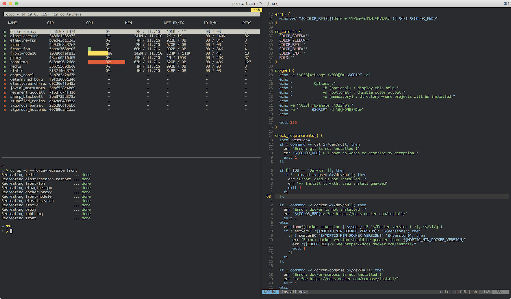

# Patatetoy - iTerm2 Color Presets

Patatetoy is a joyful [colorscheme](https://github.com/loliee/patatetoy) for daily use.



## Install

```
curl -Ls https://raw.githubusercontent.com/loliee/iterm2-patatetoy/master/patatetoy.itermcolors \
  -o /tmp/patatetoy.itermcolors
open /tmp/patatetoy.itermcolors
```

## License

MIT © [Maxime Loliée](http://loliee.com)
